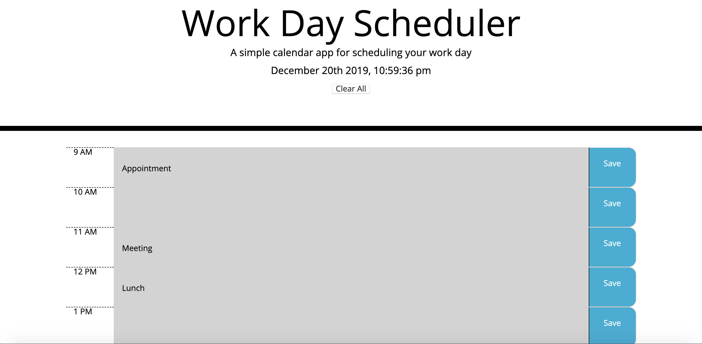

# Day Planner Application

// .DS_Store file accidentally added to repo - notes Israel gave me to remove did not work
* Link to GitHub Repo: https://github.com/danfenichel/day-planner
* Link to Deployed Application: https://danfenichel.github.io/day-planner/

* A simple calendar application that allows the user to save events for each hour of the day. This app will run in the browser and feature dynamically updated HTML and CSS powered by jQuery.
* The app should display standard business hours (9 a.m. to 5 p.m.). Each time slot should represent one hour and contain the following:
    1. The time
    1. A field to hold user input
    1. save button
* Clicking on the save button will store the time and user input in `localStorage'
# Motivation
AS AN employee with a busy schedule
I WANT to add important events to a daily planner
SO THAT I can manage my time effectively 
# Requirements
* Play proceeds as follows:
  * The user arrives at the landing page and is presented with a call-to-action to "Start Quiz." Also note the navigation option to "View Highscores" and the "Time" value set at 0.
  * Clicking the "Start Quiz" button presents the user with a series of questions. The timer is initialized with a value and immediately begins countdown.
  * Score is calculated by time remaining. Answering quickly and correctly results in a higher score. Answering incorrectly results in a time penalty (for example, 15 seconds are subtracted from time remaining).
  * When time runs out and/or all questions are answered, the user is presented with their final score and asked to enter their initials. Their final score and initials are then stored in `localStorage`.
* Your application should also be responsive, ensuring that it adapts to multiple screen sizes.
# Code style
* HTML
* CSS
* js-standard-style
# Screenshots

